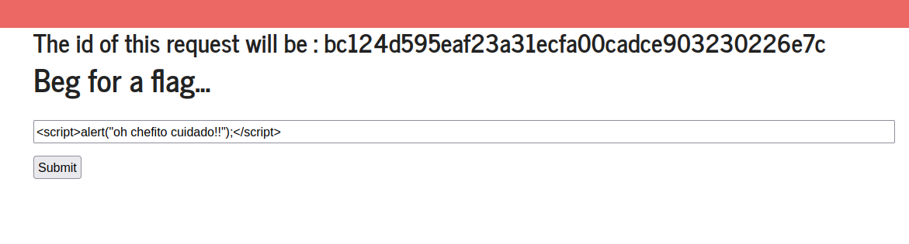
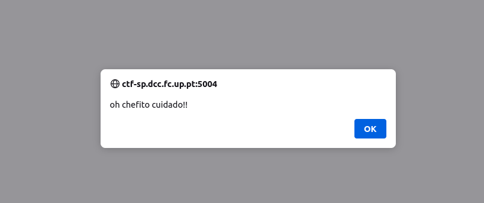
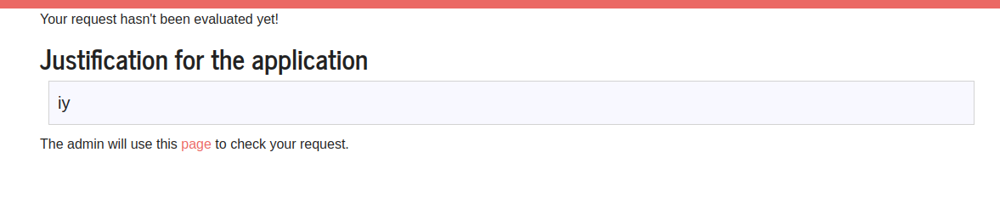
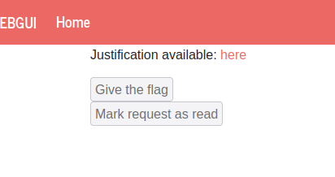
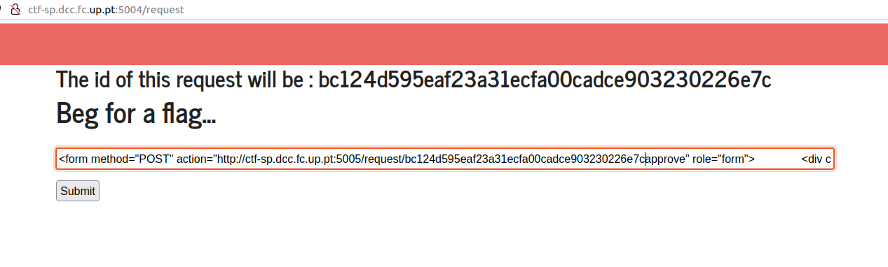
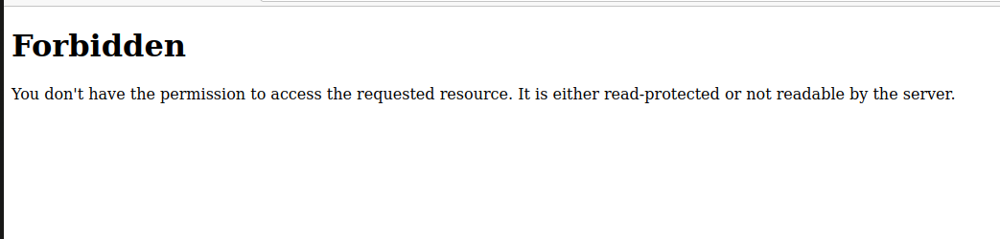
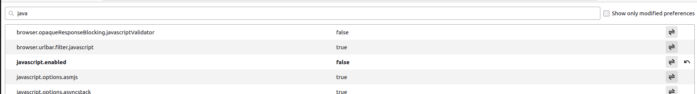
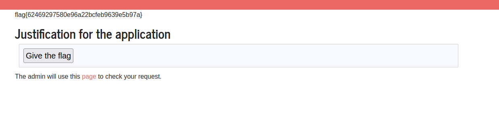

### CTF EXTRA

### Como encontramos um site muito semelhante ao que já tinhamos encontrado decidimos verificar se verificava inputs:




### Confirmamos então que sim.
### Desta vez o botão give the flag tambem está presente mas apenas depois de carregarmos numa hiperligação presente na palavra page:




### Criamos então um script que faz um post request para o link da hiperligação que incluiu o id que nos era mostrado na página principal.

### Depois disso é preciso carregar no botão give the flag que está desativado outra vez, inspecionamos a página novamente como no outro desafio o id é giveflag na mesma e fizemos seguinte script.


```html 


<form method="POST" action="http://ctf-sp.dcc.fc.up.pt:5005/request/d28778077b3991011e4a590c66e5fb1074efb8d5/approve" role="form">               <div class="submit">                           <input type="submit" id="giveflag" value="Give the flag">        </div>   </form>      <script type="text/javascript">      document.querySelector('#giveflag').click();   </script>

```



### Ao usar este script, obtivemos a seguinte mensagem de erro:



### Pesquisamos e vimos que o javascript pode ser o problema, desativamos o javascript.


### Depois disso não encontrávamos a flag na mesma, mas percebemos que depois de dar refresh tinhamos de voltar atrás, carregar em page e depois carregar em here e a flag ia finalmente aparecer.



