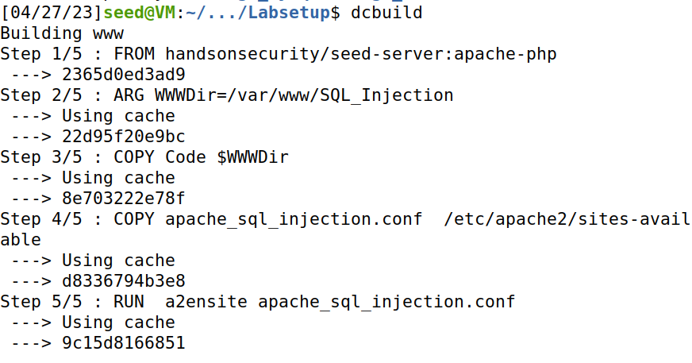

# Trabalho Realizado na Semana #8

# SETUP 

### Depois de fazer download do LabSetup fizemos docker-compose build;

### Precisavamos de alterar o ficheiro em etc/hosts para incluir a linha 
### "10.9.0.5        www.seed-server.com"

### Alteramos o ficheiro usando o sudo e essa linha passo a estar presente.

### Depois iniciamos o docker com dcup

### Fizemos dockps para descobrir o id do mysql server, e depois fizemos docksh com esse id.

## Task1 

### Demos login na consola do MYSQL, depois carregamos a database, fizemos showtables e só temos a tabela das credênciais, para imprimir os dados da cliente Alice usamos "Select * from credential where name ='Alice'"

## Task 2

### Após observar o ficheiro unsafe_home.php verificamos que tem vulnerabilidades de sql.

## Task2.1

### Conseguimos entrar como admin usando: "Admin' #" a plica que segue Admin vai fechar o campo do username e o # vai comentar o restante do código dando assim login.

## Task2.2

### Repetimos a tarefa 2.1 mas através do terminal, ao usar o curl não podemos usar ' e # então tivemos de substituir estes dois caracacteres pelos códigos ASCII correspondentes de modo a ficar como na task anterior.(admin'# == admin%27%23)

## Task2.3

### Nesta task tinhamos de tentar dar dois sql statements e para isso introduzimos no user name:
### "admin';UPDATE credential SET Salary=12 where Name='Boby';#

### Não foi possivel alterar porque a extensão PHP não permite executar queries multiplas, verificando se existe mais do que uma instrução separada por ";" antes de executar, se existir não executa e retorna este erro.

## Task3

## Task3.1

### Demos login como Alice usando "Alice'#" fomos à aba de edit profile e modificamos o salário usando a seguinte query:
### Boavista',Salary=9878 WHERE name='Alice'#
### Demos login como admin para ver se tinhamos conseguido mudar sabendo que o salário anterior da Alice era 20000

## Task3.2

### Usamos o edit profile da Alice para modificar o salário do chefe Boby:

## Task3.3

### As passwords estão encriptadas, conseguimos aceder a ela através do campo das passwords, podendo assim alterar para algo conhecido e depois aceder à conta do Boby com as credenciais corretas.

### Fizemos a conversão de uma nova palavra passe para SHA 1 e atualizamos o campo das palavras-passe na database.

## CTF Semana 8 Desafio1

### Foi dada uma página de login e nós tinhamos de dar login como admin para ter acesso à flag.

### Usamos a mesma querie de SQL no user e na Password; usamos a primeira plica para fechar o campo da Password e depois acrescentamos uma condição que é sempre verdadeira para conseguirmos entrar.

### Após entrar conseguimos a flag.

### Desafio2

### Fizemos o checksec e verificamos que o NX está desativado e que o PIE está ativo, ou seja, os endereços de memória vão passar a ser random a cada execução. Como o NX está desativado provavelmente vamos ter de injetar shellcode.

### Ao examinar o código em main.c vemos que podemos ler mais do que 100 bits, devido ao uso da função gets. Existindo uma vulnerabilidade de bufferoverflow.

### Ao correr o programa nós obtemos a base do buffer e vamos usar isso para para fazer bypass à PIE protection.

### Precisamos agora de ver quantos caracteres temos de escrever a partir da base do buffer para começar a dar overflow e escrever no returning adress, para isso usamos o gdb e criamos um padrão para encontrar esse offset.

### O offset era 107 bits e nós decidimos então criar um novo padrão com 106 bits e adicionar depois 4 caracteres para verificar se realmente era esse o valor que ficava guardado no offset.

### Observamos que o offset não guardava os 4 "B", ou seja, só começa a ler no bit 108. Para confirmar isso usamos o mesmo padrão mas desta vez colocamos algo antes dos 4 B's de forma a que o primeiro B apareça no bit 108 e dessa forma já apareceram os 4 B's.

### Criamos um exploit onde usando o pwn fomos buscar o shell code e o inserimos no inicio do payload, completamos o payload com A's até que o comprimento atinja 108 e depois disso subscrevemos o ret com o valor do buffer que nos foi dado no inicio em "Your buffer is..." como na base do buffer está o shellcode o endereço ao apontar para aí vai correr o shellcode. Depois fizemos cat flag.txt e obtivemos a flag.

