# Trabalho Realizado na Semana #10

# SETUP 

### Depois de fazer download do LabSetup fizemos docker-compose build;

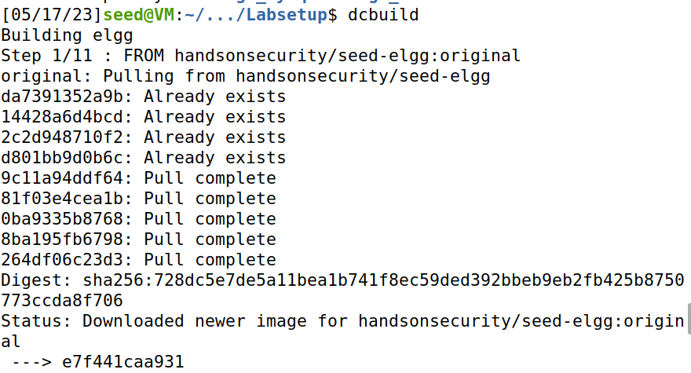

### Precisavamos de alterar o ficheiro em etc/hosts para incluir as linhas
### "10.9.0.5 www.seed-server.com
### 10.9.0.5 www.example32a.com
### 10.9.0.5 www.example32b.com
### 10.9.0.5 www.example32c.com
### 10.9.0.5 www.example60.com
### 10.9.0.5 www.example70.com"

### Ao fazer cat /etc/hosts vimos que as linhas já estavam presentes.

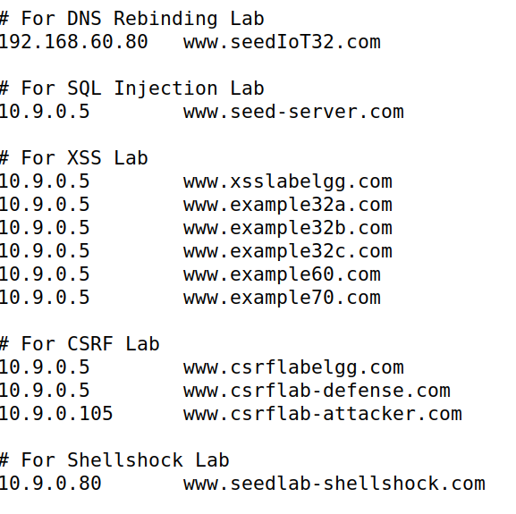


### Depois iniciamos o docker com dcup

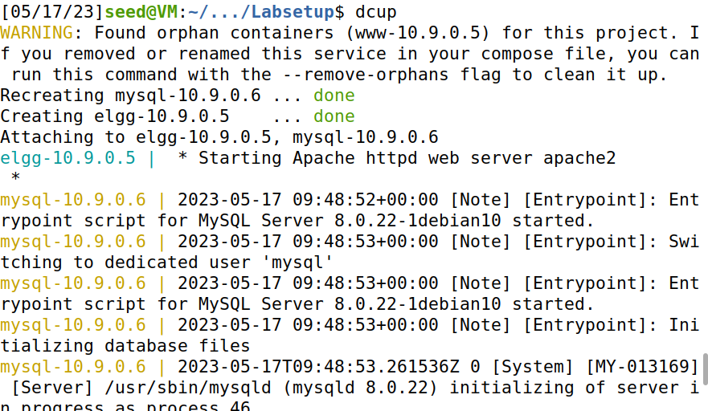

### Entramos no link www.seed-server.com e chegamos ao site para fazer os ataques.

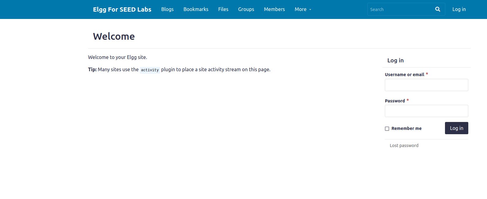

## Task1: Posting Malicious Message to Display an Alert window

### Iniciamos sessão na conta do Charlie, fomos à zona de edição de perfil e colocamos na parte de "brief description" o código do ataque.

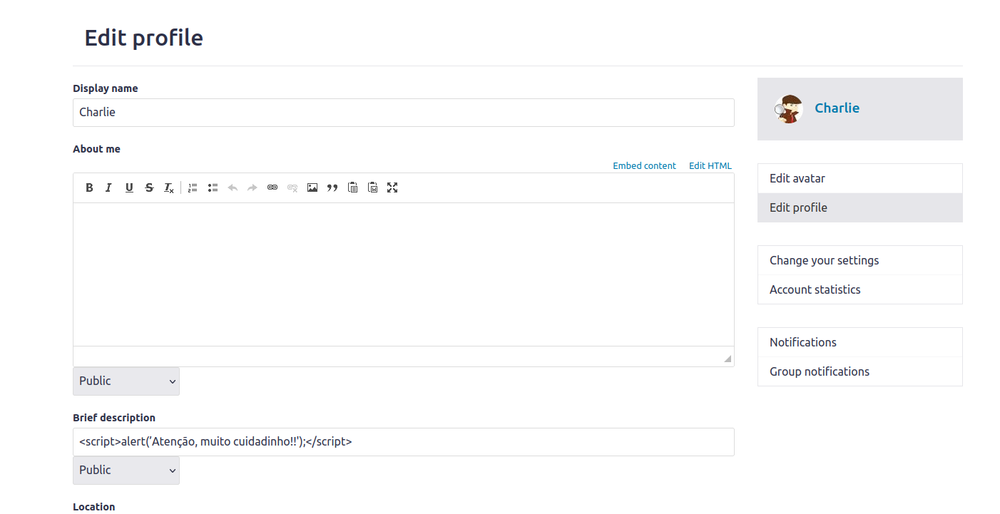

### Guardamos as informações, demos login com a alice e fomos ao perfil do Charlie para ver se a mensagem aparecia.

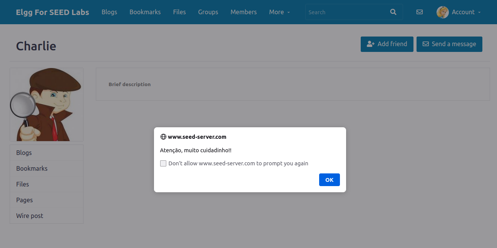

## Task2: Posting a Malicious Message to Display Cookies

### Desta vez fomos ao perfil do Sammy e colocamos no local da brief description o código dado.

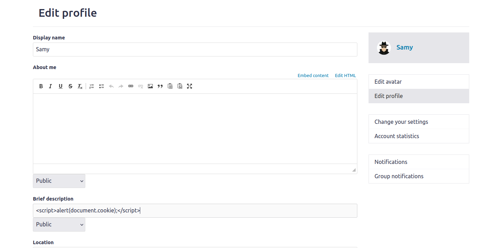

### Guardamos as modificações, fomos ao perfil do Samy através do charlie e comrpovamos que desta vez em vez do aviso, estão a aparecer os cookies da sessão atual.

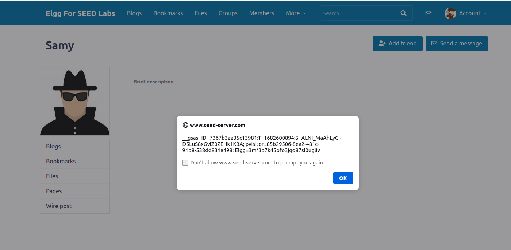

## Task3: Stealing Cookies from the Victim's Machine

### Usamos o comando nc -lknv 5555 e ficamos à espera que o browser tente carregar a imagem do url do campo src do código que vamos inserir, nessa porta vai estar um server TCP á espera de uma conexão que quando surgir  nos vai dar os cookies da vitima.

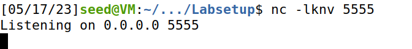

### Colocamos o código dado no perfil do Sammy, guardamos as alterações e acedemos à pagina do perfil do sammy através do charlie para ver se o recebiamos alguma coisa no terminal.

#### Perfil modificado
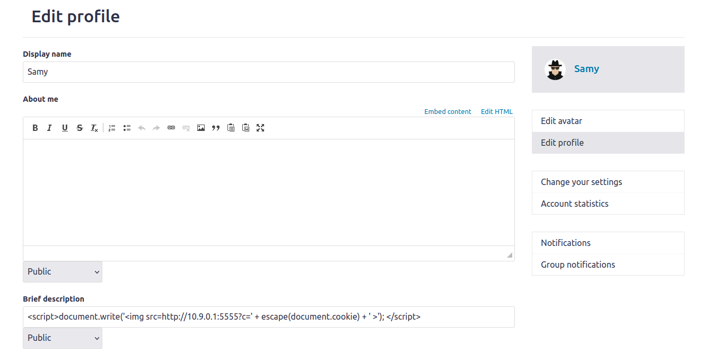
#### Aceder ao Perfil do Sammy pelo Charlie
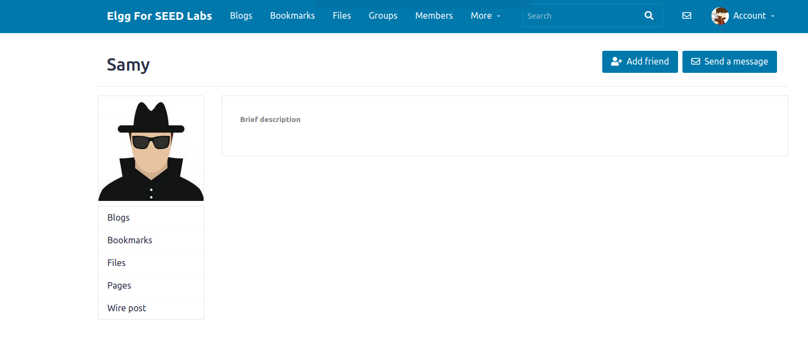
#### Cookies recebidos no terminal
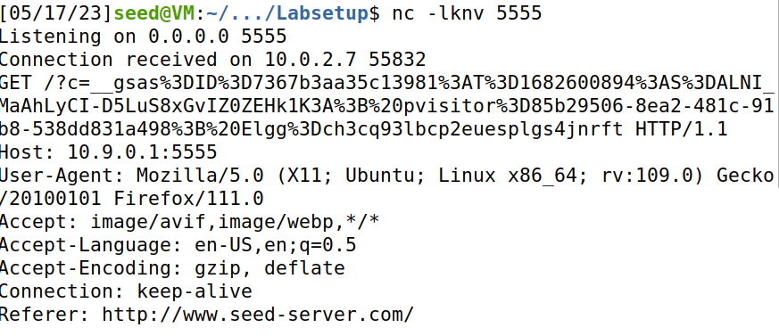

## Task4: Becoming the Victim's Friend

### Para criar um http get para fazer amigos, nós entramos na conta da Alice e adicionamos o Samy como amigo para ver o como funciona o pedido.

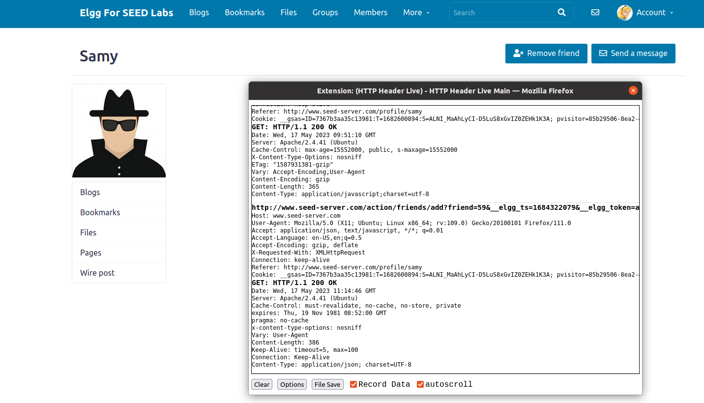


### Depois de obter o ID associado ao Samy, 59, e sabendo já como funciona o pedido http 'add friend' já conseguimos modificar o código dado:

### Inserimos no sendurl o link que nos foi dado pelo HTTP Header Live acrescentando apenas + ts+token. 

### Este código é, então, um pedido com o mesmo efeito do 'add friend' que vimos para conhecer como funcionava. O website vai enviar um pedido com o URL que colocamos na var sendurl fazendo as pessoas que visitam o perfil do Samy amigos dele automaticamente.

```html 

<script type="text/javascript">
    window.onload = function () {
    var Ajax=null;
    var ts="&__elgg_ts="+elgg.security.token.__elgg_ts;
    var token="&__elgg_token="+elgg.security.token.__elgg_token;
    //Construct the HTTP request to add Samy as a friend.
    var sendurl="http://www.seed-server.com/action/friends/add?friend=59"+ts+token
    //Create and send Ajax request to add friend
    Ajax=new XMLHttpRequest();
    Ajax.open("GET", sendurl, true);
    Ajax.send();
}
</script>

```
### Colocamos o código no campo about me do Samy

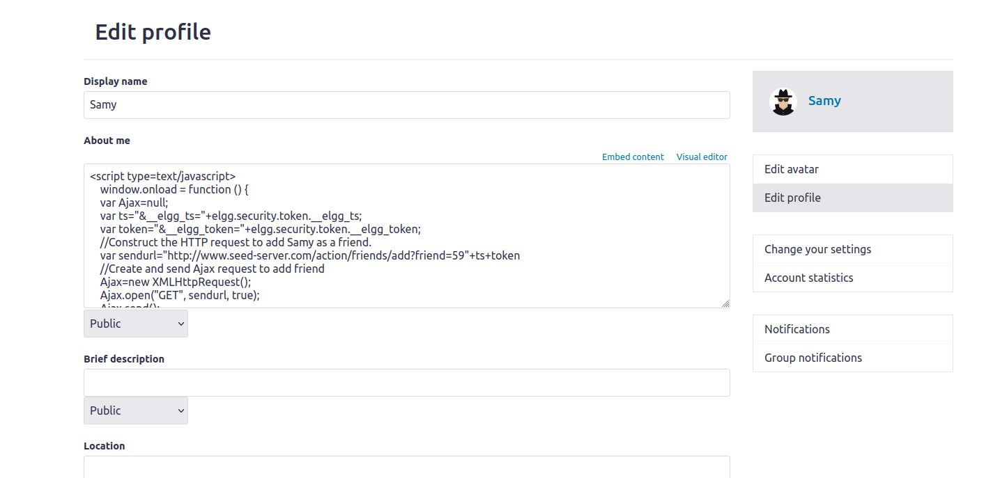

### Guardamos as alterações demos login no perfil do Charlie e seguimos os seguintes passos sem nunca adicionar o Samy manualmente.

#### Verificamos os amigos do Charlie
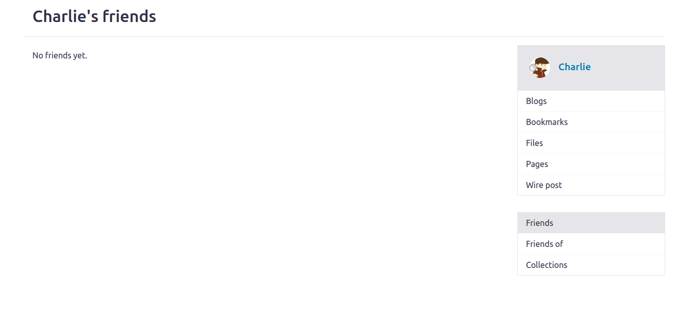
#### Fomos ao perfil do Samy
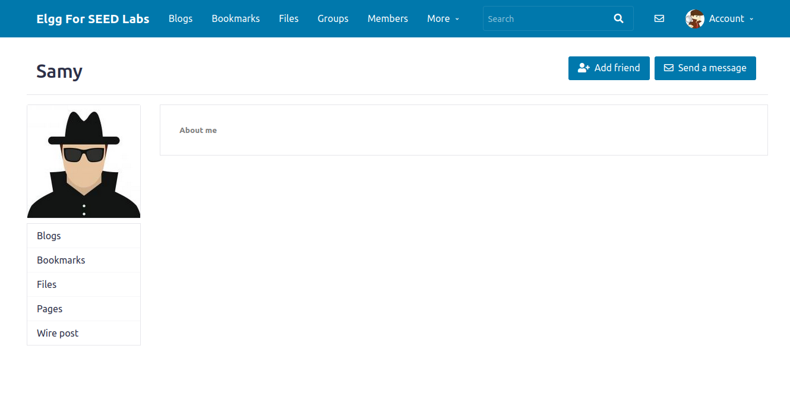
#### verificamos Novamente os amigos do Charlie
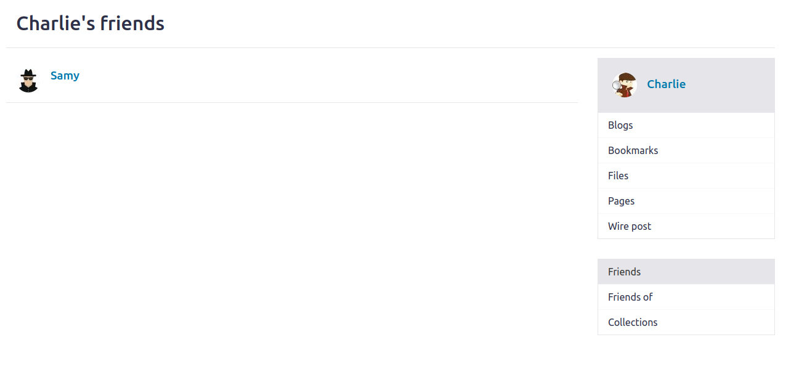

## Question1 Explain the purpose of lines 1 and 2, why are they needed?

### As linhas são necessárias porque para um pedido Http bem sucedido precisamos do secret token e do timestamp do website, se não tivermos esses valores o pedido não era tido como fidedigno e não era confiável não sendo possivel executar o ataque.
### Essas duas linhas servem para aceder a esses valores

### O ts token guarda a data e a hora de cada solicitação impedindo que uma solicitação seja repetidamente enviada para executar a mesma ação indesejada várias vezes

### O elgg_token é usado para autenticar o utilizador, garantindo assim que apenas os utilizadores autenticados e autorizados possam realizar uma ação.

### Eles têm de ser usados em conjunto uma vez que em cada ação é chamada uma função que valida os tokens. Se algum dos tokens não estiver presente ou for inválido a ação vai ser negada e o ataque não vai ser bem sucedido.

## Question2 If the Elgg application only provide the Editor mode for the "About Me" field, i.e.., you cannot switch to the Text mode, can you still launch a sucessful attack?

### Não, para o nosso código precisamos de usar, por exemplo, </script>  e modo editor codifica os caracteres especiais do input. Ou seja se usassemos </script> e todos os outros caracteres especiais eles iam ser codificados e o código não ia ser executado


## CTF Semana 10 

## Desafio1

### Após cada pedido temos de esperar que ele seja avaliado e aí sim percebemos se o pedido teve sucesso ou não

### Decidimos colocar um código em javscript para ver se existia alguma verificação de inputs ou se era possivel atacar por aí

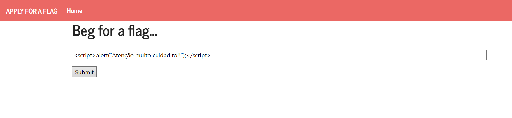
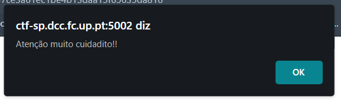

### Concluimos então que vamos conseguir obter a flag se usarmos o código javascript adequado uma vez que os inputs não são verificados.

### O que nós queremos é conseguir clicar no botão que diz 'Give the flag' que aparece aquando da avaliação:

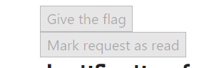

### Podemos fazer isso com javascript mas precisamos de saber qual é o ID desse botão após inspecionar a página web vemos que o id é giveflag:

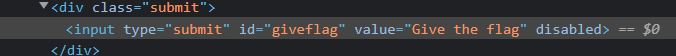

### Introduzimos este input no formulário que vai procurar um elemento com aquele id e simular um clique, com isso vamos obter a flag.

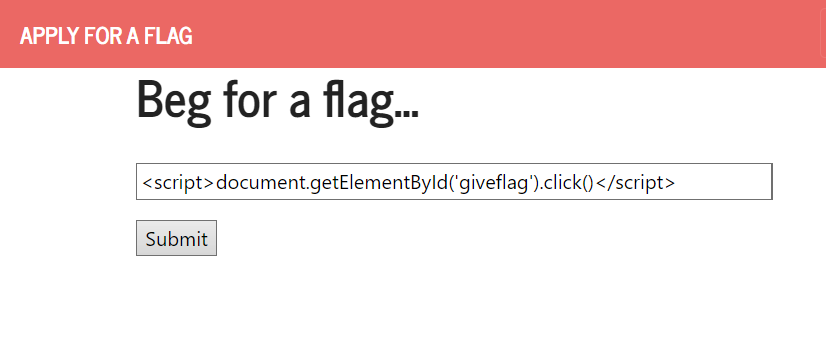

### Após esperar algum tempo, o servidor mostrou-nos a flag:

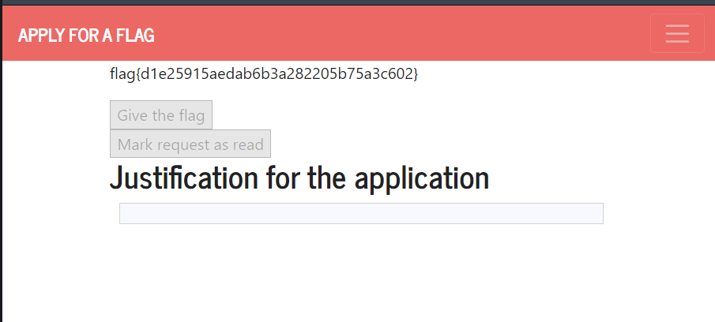


## Desafio2

### A página dá-nos a possibilidade de autenticação, tentamos usar injeção de sql mas não foi possivel e portanto avançamos para outra página para a qual fomos redirecionados após carregar no botão 'Here'.

### Nessa página temos várias opções, ou carregamos em 'Speed report' aparecendo um gif, ou damos ping a um host.  

### Decidimos dar Ping a hosts conhecidos, como o da Google DNS (8.8.4.4) para ver o que acontecia.

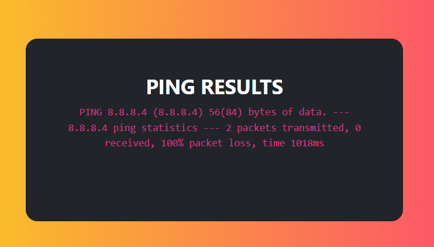

### Chegamos à conclusão que o output que obtivemos é que para dar PING a um host o sistema está a usar o comando PING que podemos usar no terminal tambem.

### Por isso decidimos dar ping ao host do servidor e executar algum comando bash para ver se funcionava:
### Escrevemos 5000; ls;

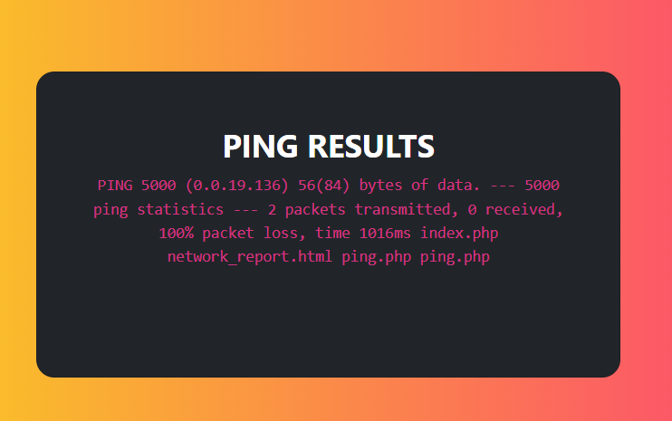

### Estávamos corretos e concluimos então que separando os comandos com o caracter ';' podemos executar vários.

### A flag costuma estar no ficheiro flag.txt então usamos os comandos ls e cd para encontrar esse ficheiro para depois fazer cat flag.txt

### Fomos fazendo cd .. um de cada vez e quando chegamos ao 4º obtivemos o seguinte output:


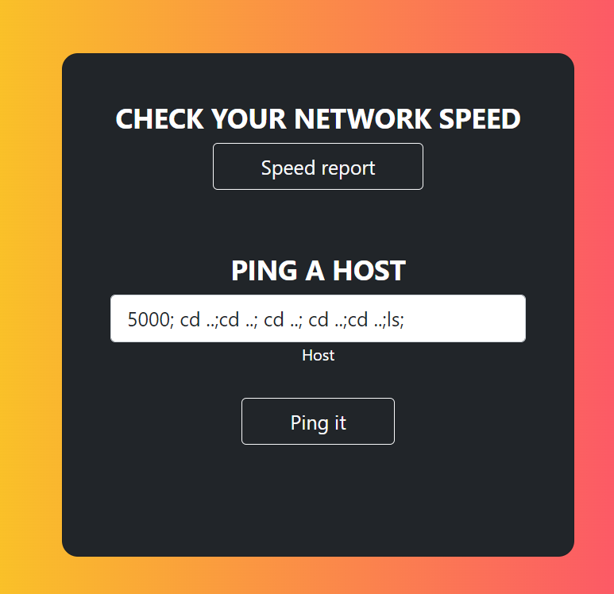
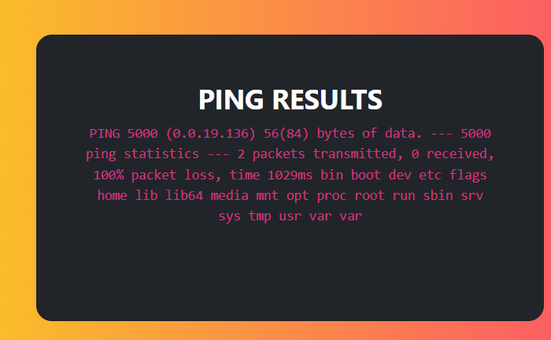

### Tentamos fazer cat flags.txt mas não deu, concluimos então que era uma pasta, fizemos mais um cd flags seguido de ls:
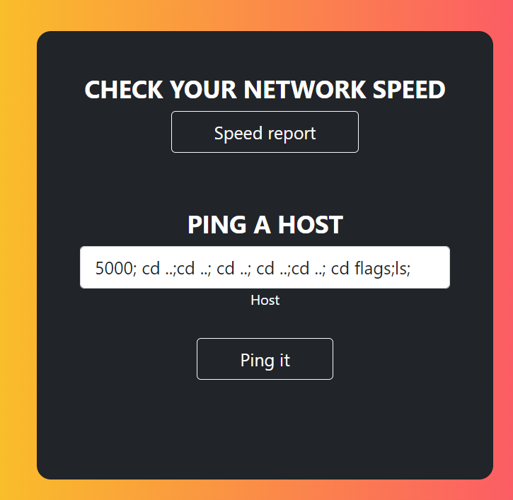
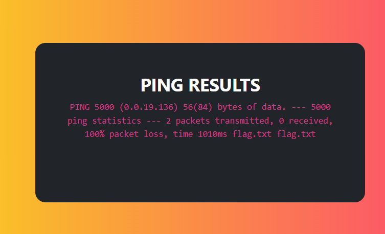

### Finalmente encontramos os ficheiros flag.txt, subsituimos o ultimo ls por cat flag.txt e obtivemos a flag.

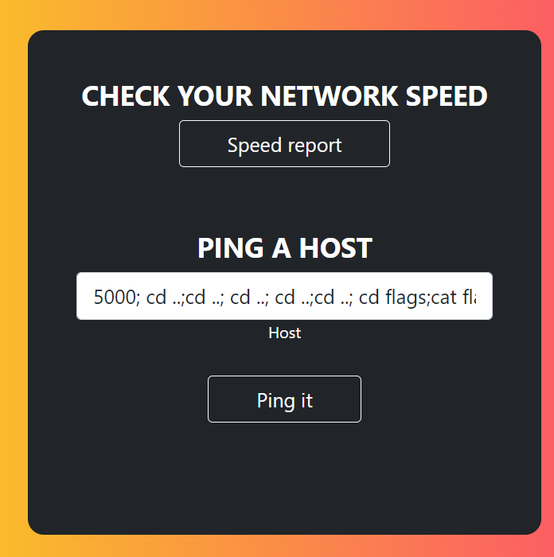
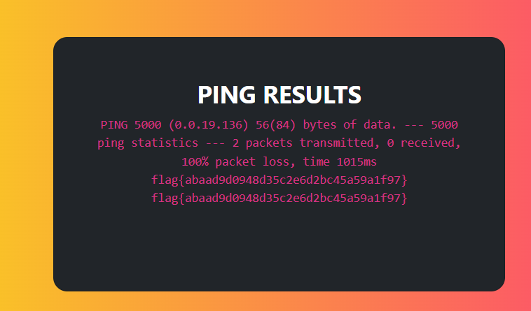


