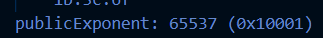
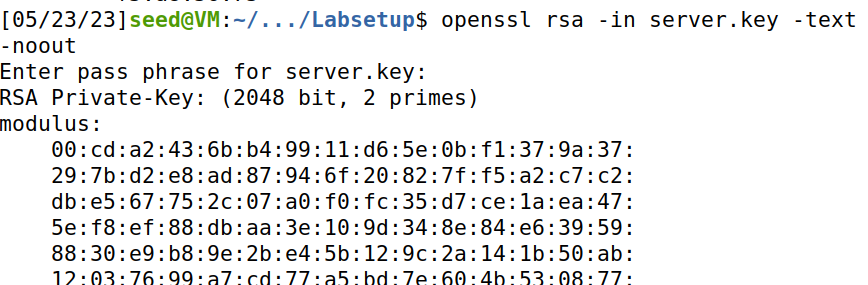
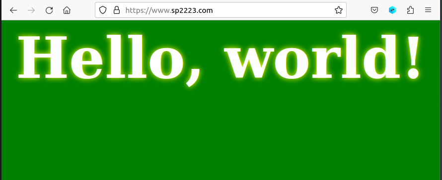

# Trabalho Realizado na Semana 11

# SETUP 

### Depois de fazer download do LabSetup fizemos docker-compose build;

### Tivemos de adicionar ao ficheiro /etc/hosts as linhas: " 10.9.0.80 www.bank32.com   10.9.0.80 www.sp2223.com"

### Usamos sudo nano /etc/hosts para conseguir modificar o ficheiro e incluimos essas linhas.

## Task1

### O OPENSSL usa o arquivo /usr/lib/ssl/openssl.cnf. Precismos de fazer alterações nesse arquivo vamos copiá-lo para o nosso diretório atual e fazer o OPENSSL usar esta cópia modificada.

### Dentro do ficheiro openssl.cnf podemos observar a parte [CA default] que nos diz que ficheiros e que diretórios precisamos de correr. É nesta parte que vamos fazer a modifcação colocando a linha unique subject sem estar comentada.

### Criamos então dentro do dirétorio atual, uma pasta chamada demoCA. Dentro dela três pastas: certs, newcerts e crl e dois ficheiros index.txt(vazio) e serial(com o número 1000).

### Corremos o comando : "openssl req -x509 -newkey rsa:4096 -sha256 -days 3650 \-keyout ca.key -out ca.crt"

### Inserimos todas as informações e conseguimos obter o certificado self-assigned para a CA:

### Corremos depois estes comandos para obter os ficheiros ca.crt e ca.key: 

### " openssl x509 -in ca.crt -text -noout
### openssl rsa -in ca.key -text -noout "

### Obtivemos os seguintes ficheiros: [ca.crt](./ca_crt.txt)
### [ca.key](./ca_key.txt)

## Questão 1: What part of the certificate indicates this is a CA's certificate?

### Podemos verificar que é um certificado CA porque a variável CA está true:

## Questão 2: What part of the certificate indicates this is a self-signed certificate?

### Podemos ver que o certificado é self-signed porque o X509v3 Subject Key Identifier e o X509v3 Authority Key Identifier são iguais.

## Questão 3: In the RSA algorithm, we have a public exponent e, a private exponent d, a modulus n, and two secret numbers p and q, such that n = pq. Please identify the values for these elements in your certificate and key files.

### O modulos e o public exponent aparecem em ambos os ficheiros, já os outros apenas aparecem no ficheiro da key.

#### Publix exponent:

#### Private exponent:

#### Modulus:

#### p

#### q

## Task2

### Com este comando conseguimos criar um CSR associado ao servidor. Usamos o nosso próprio server name: www.sp2223.com e ainda adicionamos dois nomes alternativos.

## Task3

### Usando o comando em baixo conseguimos transformar o pedido de certificado num certificado X509.

### O ficheiro openssl.cnf não permite ao comando copiar a extensão do pedido para o certificado, para tornarmos isso posivel usamos "nano openssl.cnf" e colocamos a linha " copy_extensions=copy" sem estar comentada.

### Depois de fazer isso corremos um comando que nos deu o conteudo do certificado descodificao e conseguimos comprovar que os dois nomes alternativos estão incluidos.

## Task4

###  O objetivo agora passa por usar os certificados com o nosso servidor. Para isso precisamos de configurar o nosso próprio site.

### Para isso demos inicio a shell do nosso container e modificamos o ficheiro bank32_apache para o nosso próprio site.

### Depois disso executamos os seguintes servindo o primeiro para ativar o módulo apache e segundo para ativar o website descrito no ficheiro.

### De seguida iniciamos o servidor fazendo service apache2 start:

### Carregando no link obtemos esta página:

### Se colocarmos https:// no inicio do URL obtemos o seguinte aviso de falta de segurança. Isto ocorre porque o certificado que criamos não foi carregado para o firefox.

### Para resolver este problema vamos manualmente adicionar o nosso certificado ao firefox:

### Depois disso damos refresh ao website e ele fica verde e apresenta-se como seguro:

## Task5

### Esta tarefa tem como objetivo mostrar que o PKI pode impedir ataques Man-In-The-Middle.

### O nosso target foi o website www.aliexpress.com

### Alteramos o ficheiro etc/hosts e o sp2223_apache_ssl.conf para quando acedermos ao site www.aliexpress.com sermos redirecionados para o nosso server malicioso.

### se agora tentarmos aceder ao website www.aliexpress.com o resultado vai ser este:

### Isto acontece porque estamos a usar o certificado o que geramos para o www.sp2223.com. O firefox tem medidas de defesa que detetam que o nome do certificado digital não corresponde ao nome esperado, não tendo o servidor um certificado CA válido.

## Task6

### Nesta tarefa vamos gerar um novo certificado. Quando uma CA é comprometida e o atacante tem acesso à private key ele pode criar os certificados que ele quiser.

### Com as chaves CA roubadas, podemos emitir certificados válidos. Depois de os emitir vamos instalá-los no apache server assim a vitima não vai perceber que está a ser enganada quando tentar entrar no site porque ela confiava nessa CA.

### Repetimos os comandos da Task 1 e geramos um certificado task 2 e 3 mas desta vez especificando aliexpress.com como a entidade que pede a certificação.

### " openssl req -newkey rsa:2048 -sha256 -keyout server.key -out server.csr -subj "/CN=www.aliexpress.com/O=aliexpress Inc./C=US" -passout pass:dees"

### O resultado foi a emissão de um certificado e uma chave publica que injetamos no servidor apache2. Depois de reiniciar o server o resultado passou a ser de segurança.

## Semanas12 e 13

## Desafio1

### Sempre que nos conectamos ao servidor ele envia uma flag encirptada com RSA:

### Vamos usar este script para a desencriptar:

### Sabemos que o p e o que são proximos de 2^512 e 2^513 respetivamente. Por isso usamos nextprime() para obter o proximo numero primo maior que o valor especificado que em principio iria ser um valor adequado.
### No d usamos uma formula que atraves de d * e % ((p-1) * (q-1)) = 1 nos permite calcular o d.

### Corremos o script e obtemos a flag:

## Desafio2

### Desta vez o servidor envia duas mensagens com o mesmo N mas com dois expoentes publicos diferentes:

### Para descodificar as mensagens usamos o seguinte script:

### mensagem1 e mensagem2 contêm as mensagens enviadas pelo sevidor e e1 e e2 as chaves públicas de mensagem1 e mensagem2, respetivamente.

### Se mdc(e_s,e_j) = 1, então ∃a,b∈Z: e1*a + e2*b = 1.Calculámos os coeficientes a e b (a = 32769 e b = -32768). 

### Como b é negativo, a equação m = (mensagem1^a * mensagem2^b) mod n daria problemas, por isso, calculámos o inverso modular de mensagem2 (i = mensagem2^(-1) mod n) e, finalmente, obtivemos a mensagem com m = (mensagem1^a * i^(-b)) mod n.

### Essa mensagem obtida é a flag.

                

