# Semana 7

### Compilamos o servidor com a vulnerabilidade

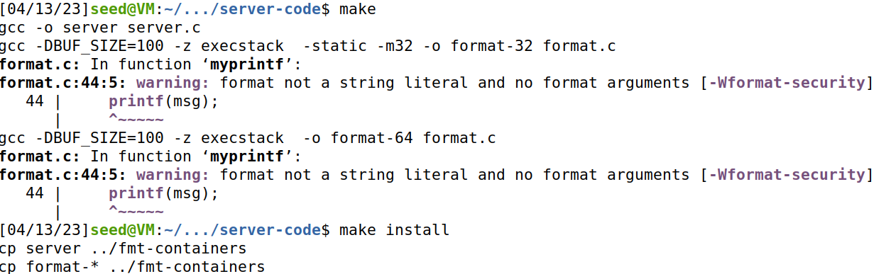

### Colocamos o server a funcionar num terminal.

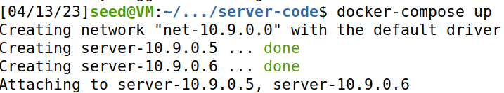

## Task1

### Mandamos a mensagem hello para o servidor pressionado em seguida CTRL+C e no outro terminal(2)vimos o que foi impresso.

#### Terminal1
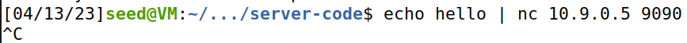

#### Terminal2
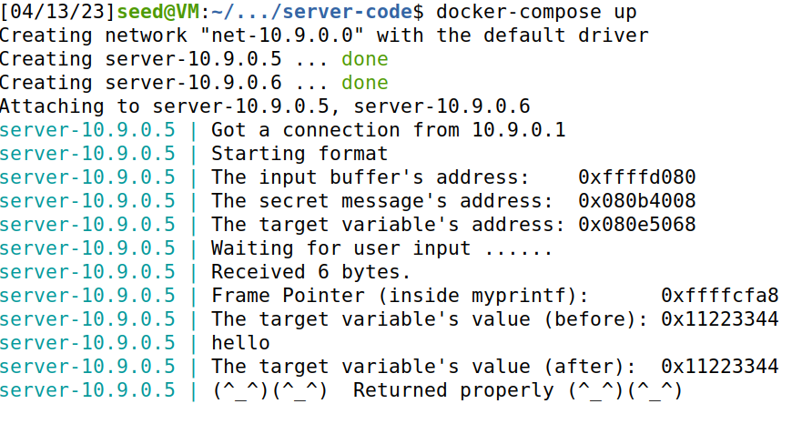

### Se dermos como input um "%s"(Terminal1) o programa vai procurar uma string e como para isso vai ter de aceder a zonas de memória desconhecidas e vai crashar(Terminal2)

#### Terminal1
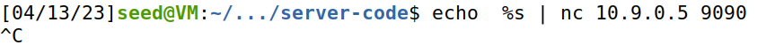

#### Terminal2
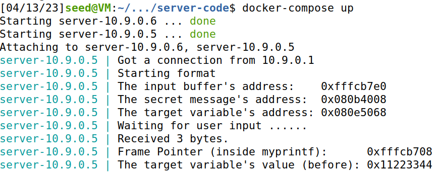

## Task2

## A

### Para imprimir o endereço do que nós demos como input nós decidimos colocar 4 caracteres iguais para facilitar a procura(pppp) e em seguida colocamos vários %x para os endereços serem impressos, tentamos adivinhar o valor de %x por tentativa erro.

### Na primeira tentativa colocamos apenas 3 %x.

#### Terminal1
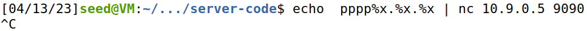

#### Terminal2
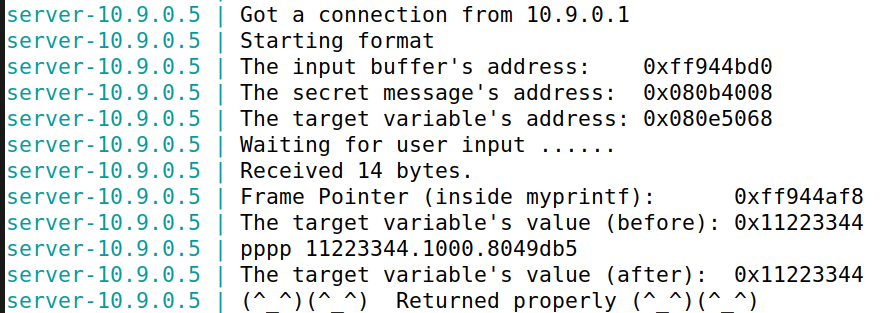

### Na segunda tentativa colocamos  28 %x.

#### Terminal1
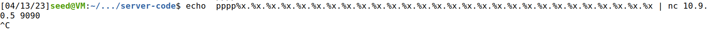

#### Terminal2
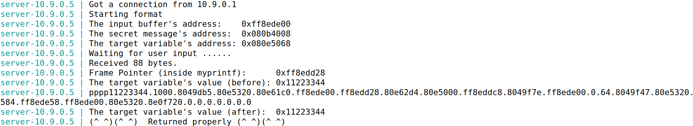

### Por ultimo decidimos colocar muitos %x e procurar o valor que tinha 4 números repetidos, que representava o nosso input, (pppp=70707070) e vimos que estava no endereço 64.

#### Terminal1
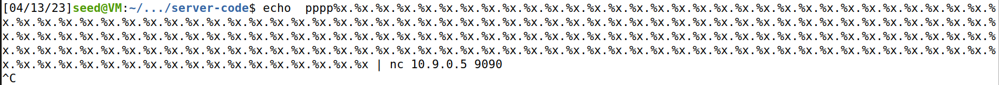

#### Terminal2
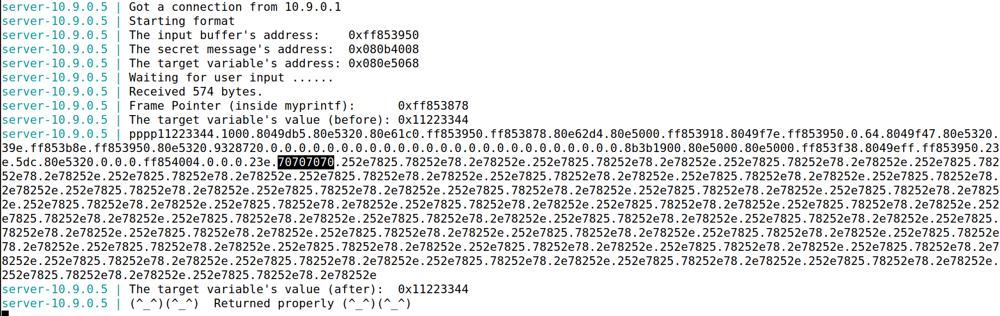

## B

### Alteramos o ficheiro build_string.py: Modificamos o number para o endereço da secret message que nos é dado sempre que o server corre. Mudamos o s para ir até ao endereço 63 e no 64 imprimir a string correspondente.

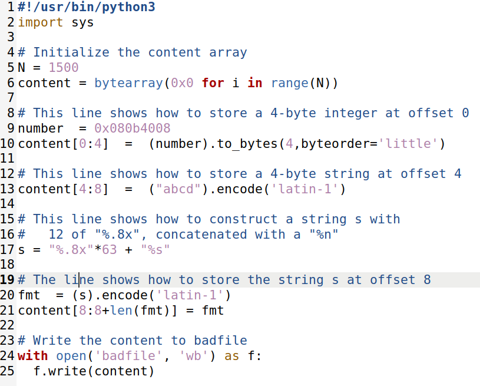

### Corremos o programa para criar o badfile. Demos como input o ficheiro e obtemos a string do endereço no terminal do servidor.

#### Terminal1
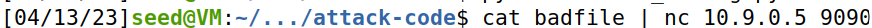

#### Terminal2
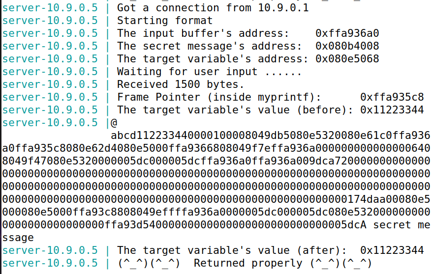

## Task3

## A

### Demos como input o valor do endereço da target variable e depois  63 %x e um %n(Terminal1). Sabemos que o que damos como input fica na posição 64 se chegarmos a essa posição e pusermos o %n o valor da variável vai ser alterado(Terminal2)

#### Terminal1
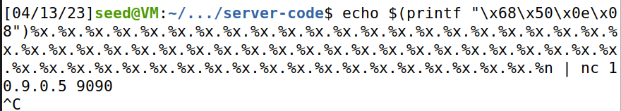

#### Terminal2
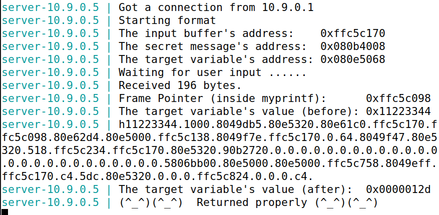

## B

### Demos como input o valor do endereço da target variable novamente mas desta vez tivemos de dar um número de bytes exatos que é 19980: Tivemos de chegar à posição 63 para modificar a posição 64, como cada uma das 63 posições ocupa 8 caracteres(63*8=504) o valor ao qual nós queremos chegar é 20480(0x5000 em décimal) subtraindo o numero de caracteres que já temos ao nosso objetivo (20480-504=19976) ao qual somamos 4 para chegarmos ao resultado correto.

#### Terminal1
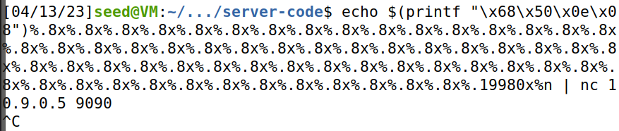

#### Terminal2
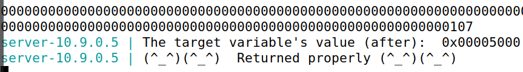

# CTF Semana 6

## Desafio 1

### Verificamos as proteções do programa e verificamos que o PIE(Adress Randomization) está desativado e, por isso, os endereços são sempre os mesmos.

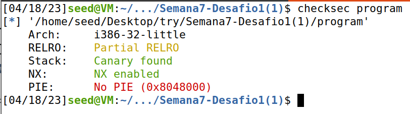

### Corremos o exploit, como explicado no ficheiro, para obter o process id para dar attach

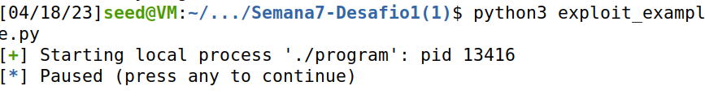

### Demos attach ao processo do exploit_example 

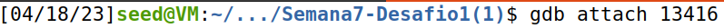

### Usamos o comando p &flag para dar print ao endereço da variável flag no processo ao qual demos attach.

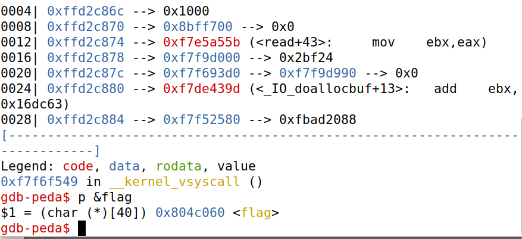

### Como no printf do main.c, não são utilizadas strings de formatação nós conseguimos controlar o formato do output.

### Mudamos o LOCAL para false, assim o exploit vai conectar-se ao servidor. Mudamos tambem a linha que enviamos para o servidor, enviando primeiro o endereço da flag seguido de uma string de formatação %s para imprimir o conteudo desse endereço.   

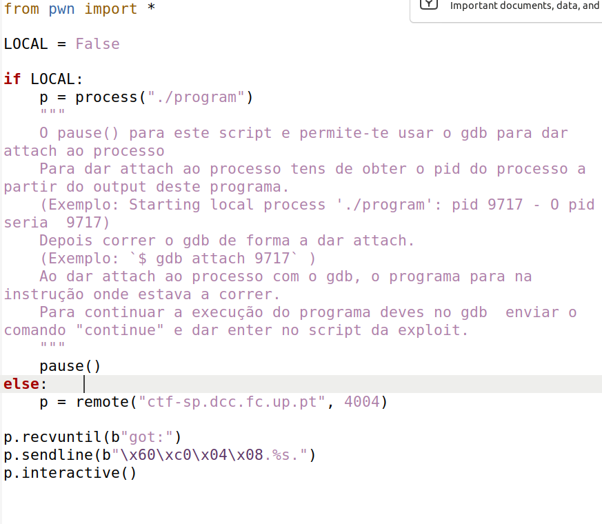

### Corremos o exploit e obtivemos a flag.

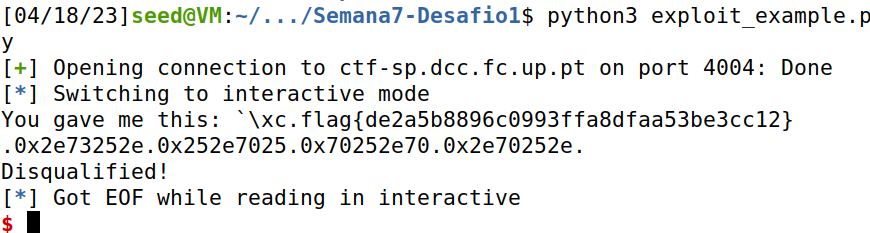

## Desafio 2

### O checksec do programa é o mesmo que o do desafio anterior, ou seja, o PIE(Adress Randomization) está desativado e, por isso, os endereços são sempre os mesmos.

### Neste caso o programa não tem acesso à flag diretamente mas o programa cria uma bash onde podemos ver o conteudo do ficheiro flag.txt e assim obter a flag.

### Para isso a variável key tem de ser igual a 0xbeef, e depois é usada uma system("/bin/bash") que permite então aceder à consola.

### Corremos o exploit localmente para obter o pid para dar attach

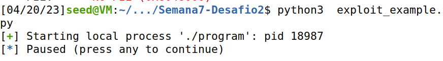

### Demos attach ao processo com o gdb e fomos buscar o endereço da variável key.

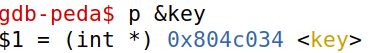

### Modificamos o ficheiro exploit: Colocamos local a False para se conectar ao servidor; Mudamos o input que damos ao servidor, começamos com 4 'a' para dar inicio ao ataque ao buffer, depois colocamos o endereço da key e em seguida imprimimos 48871( queremos que a variável key seja igual a 0xbeef=48879 como no input já temos o endereço da key(4 bytes) e os 4'a'(4 bytes) sobram 48871) caracteres dando um %n depois para guardar no endereço da variável key o número de bytes impressos até ao momento. 

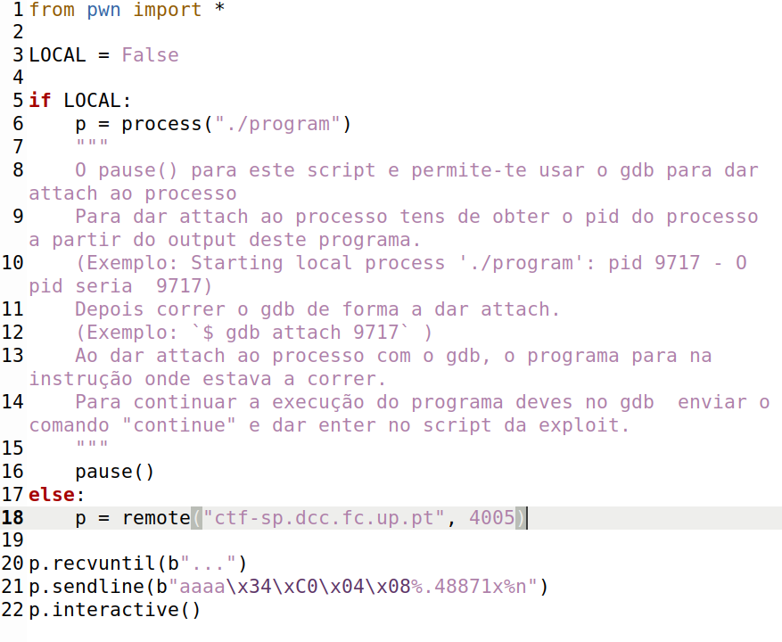

### Corremos o programa e obtivemos a consola.

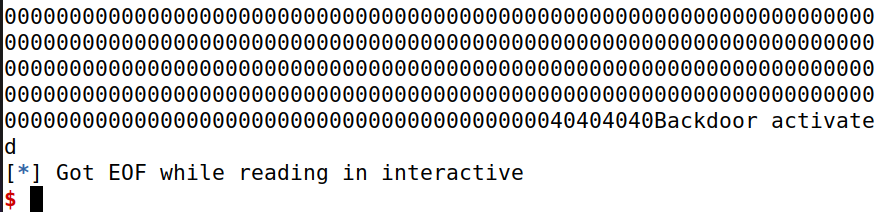

### Escrevemos cat flag.txtx para ver o que estava no ficheito flag.txt 

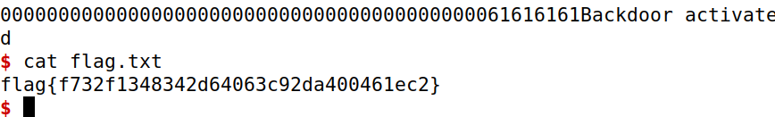