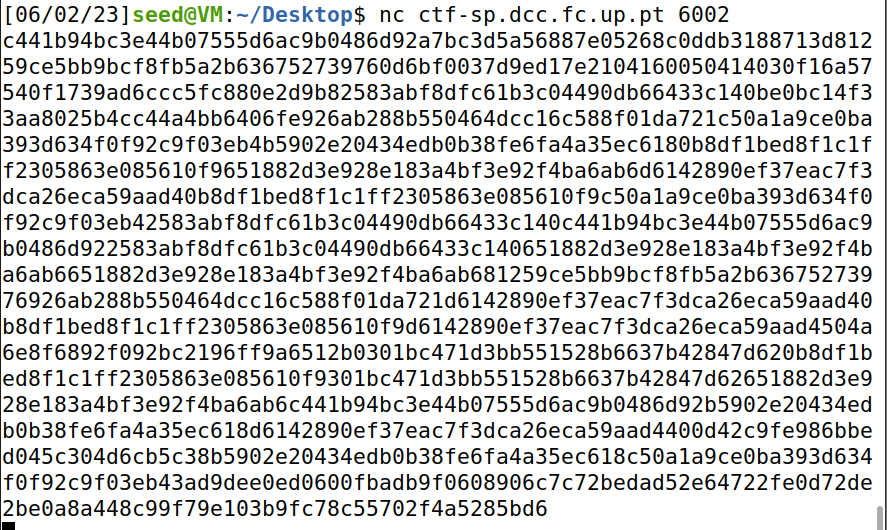
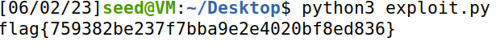

## CTF EXTRA

### Corremos o comando nc e obtivemos uma sequencia de numeros encriptada.



### Para gerar o k é usado o número 16, ou seja, existem 2^16 valores possiveis para o k.

### Para descodificar a mensagem criamos um ciclo for que testa todos os valores de k possiveis(2^16), depois descodifica a mensagem para cada k diferente. E quando o inicio da mensagem for flag ele imprime a mensagem.

```python
# Python Module ciphersuite
import os
import sys

from cryptography.hazmat.backends import default_backend      
from cryptography.hazmat.primitives.ciphers import Cipher, algorithms, modes
from binascii import hexlify, unhexlify

# Use crypto random generation to get a key with length n
def gen():
    rkey = bytearray(os.urandom(16))
    for i in range(16): rkey[i] = rkey[i] & 1
    return bytes(rkey)


# Bitwise XOR operation.
def enc(k, m):
    cipher = Cipher(algorithms.AES(k), modes.ECB(), 			backend=default_backend())      
    encryptor = cipher.encryptor()
    cph = b""
    for ch in m:
	    cph += encryptor.update((ch * 16).encode())
	    cph += encryptor.finalize()
    return cph


# Reverse operation
def dec(k, c):
    assert len(c) % 16 == 0
    cipher = Cipher(algorithms.AES(k), modes.ECB(), 			backend=default_backend())      
    decryptor = cipher.decryptor()
    blocks = len(c) // 16
    msg = b""
    for i in range(0, (blocks)):
	    msg += decryptor.update(c[i * 16:(i + 1) * 16])
	    msg = msg[:-15]
    msg += decryptor.finalize()
    return msg


un_flag = "c441b94bc3e44b07555d6ac9b0486d92a7bc3d5a56887e05268c0ddb3188713d81259ce5bb9bcf8fb5a2b636752739760d6bf0037d9ed17e2104160050414030f16a57540f1739ad6ccc5fc880e2d9b82583abf8dfc61b3c04490db66433c140be0bc14f33aa8025b4cc44a4bb6406fe926ab288b550464dcc16c588f01da721c50a1a9ce0ba393d634f0f92c9f03eb4b5902e20434edb0b38fe6fa4a35ec6180b8df1bed8f1c1ff2305863e085610f9651882d3e928e183a4bf3e92f4ba6ab6d6142890ef37eac7f3dca26eca59aad40b8df1bed8f1c1ff2305863e085610f9c50a1a9ce0ba393d634f0f92c9f03eb42583abf8dfc61b3c04490db66433c140c441b94bc3e44b07555d6ac9b0486d922583abf8dfc61b3c04490db66433c140651882d3e928e183a4bf3e92f4ba6ab6651882d3e928e183a4bf3e92f4ba6ab681259ce5bb9bcf8fb5a2b63675273976926ab288b550464dcc16c588f01da721d6142890ef37eac7f3dca26eca59aad40b8df1bed8f1c1ff2305863e085610f9d6142890ef37eac7f3dca26eca59aad4504a6e8f6892f092bc2196ff9a6512b0301bc471d3bb551528b6637b42847d620b8df1bed8f1c1ff2305863e085610f9301bc471d3bb551528b6637b42847d62651882d3e928e183a4bf3e92f4ba6ab6c441b94bc3e44b07555d6ac9b0486d92b5902e20434edb0b38fe6fa4a35ec618d6142890ef37eac7f3dca26eca59aad4400d42c9fe986bbed045c304d6cb5c38b5902e20434edb0b38fe6fa4a35ec618c50a1a9ce0ba393d634f0f92c9f03eb43ad9dee0ed0600fbadb9f0608906c7c72bedad52e64722fe0d72de2be0a8a448c99f79e103b9fc78c55702f4a5285bd6"
un_flag = unhexlify(un_flag)

for i in range(2**16):
    k = gen()
    result = dec(k, un_flag)
    result = result.decode('latin-1')
    first_chars = result[:5]
    if first_chars == 'flag{':
    	print(result)
    	sys.stdout.flush()
    	break
```

### Corremos o exploit e obtivemos a flag.




